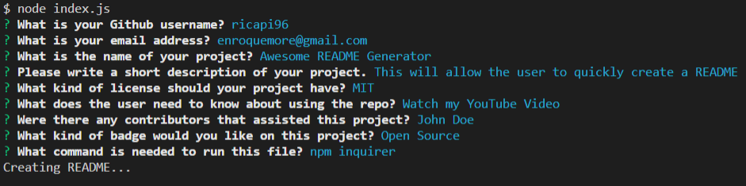
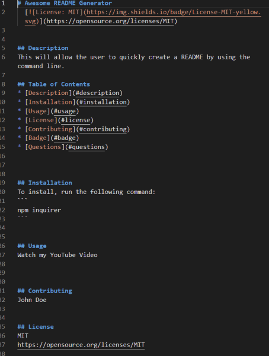
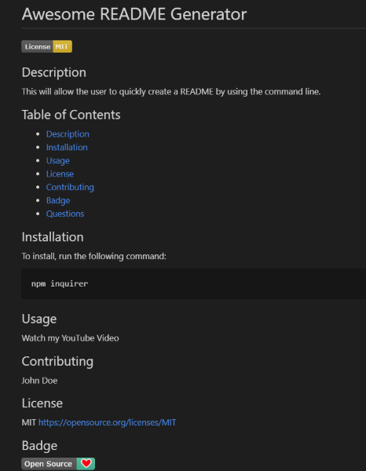

# Professional README Generator
[](https://opensource.org/licenses/MIT)

## Description
This allows one to quickly and easily create a README file by using a command-line application to generate one. This allows the project creator to devote more time to working on the project.

## Table of Contents
* [Description](#description)
* [Installation](#installation)
* [Walkthrough Video](#walkthroughvideo)
* [Screenshots](#screenshots)
* [License](#license)
* [Contributing](#contributing)
* [Questions](#questions)

## Installation
To install, run the following command:
```
npm inquirer/npm i
```
- to use require, you must have inquirer version set to 8 or lower in the `package.json`

## Walkthrough Video
https://youtu.be/BS_17z9S8oo

## Screenshots




## License
MIT
https://opensource.org/licenses/MIT


## Questions
* If you have any questions or concerns, please contact me at https://github.com/ricapi96, or email me at enroquemore@gmail.com


                                💙 Made by Erica Roquemore 💙
